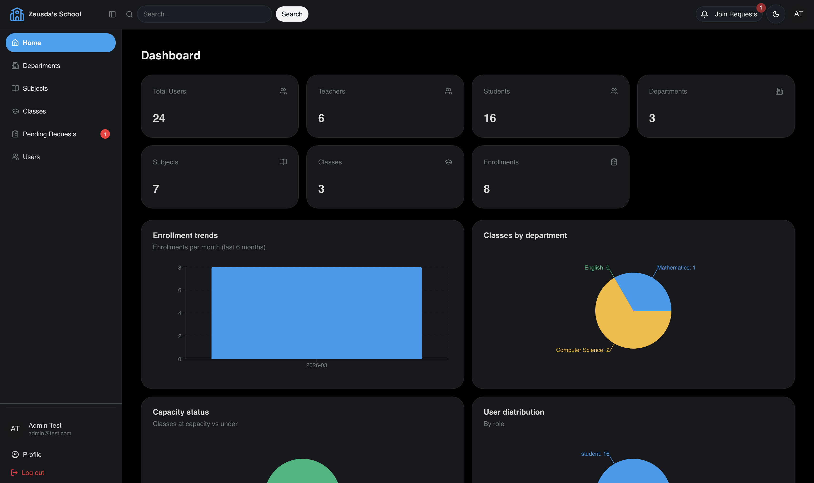
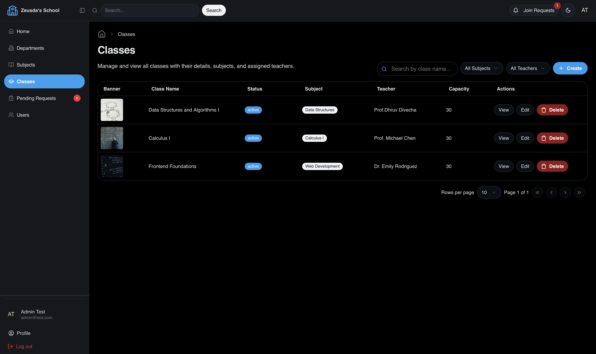

# Zeusda's School — Frontend

A modern classroom management web application built with **React**, **Refine**, and **shadcn/ui**. Features role-based dashboards and access control for admins, teachers, and students.

<!-- Screenshots -->
<p align="center">
  
  
</p>


---

## Tech Stack

| Layer         | Technology                                                      |
| ------------- | --------------------------------------------------------------- |
| Framework     | **React 19** with **TypeScript**                                |
| Meta-framework | **Refine v5** (data provider, auth, access control, routing)   |
| UI Library    | **shadcn/ui** + **Radix UI** primitives                        |
| Styling       | **Tailwind CSS v4**                                             |
| Charts        | **Recharts**                                                    |
| Forms         | **React Hook Form** + **Zod** validation                       |
| Auth Client   | **Better Auth** (React client)                                  |
| Routing       | **React Router v7**                                             |
| Build Tool    | **Vite**                                                        |
| Deployment    | **Vercel**                                                      |

---

## Features & Demo

### Student POV

<!-- Replace the src with your video URL or file path -->
<video src="" controls width="100%">
  Your browser does not support the video tag.
</video>

- View enrolled classes with schedules and teacher info
- Browse available classes and subjects
- Request to join classes with an optional message to the teacher
- See join request status (Pending / Approved / Rejected) on the classes list
- Track pending join requests
- Personal dashboard with enrolled class overview
- Mobile: class names link directly to class details page

---

### Teacher POV

<video src="" controls width="100%">
  Your browser does not support the video tag.
</video>

- Create and manage own classes (schedule, capacity, banner image)
- View and manually enroll students per class
- Approve or reject student join requests
- Dashboard with own class stats, enrollment counts, and pending requests
- Edit class details, status, and schedules
- **Note:** Unapproved teachers (email not verified) see a student view until an admin verifies their account

---

### Admin POV

<video src="" controls width="100%">
  Your browser does not support the video tag.
</video>

- Full CRUD for **Departments**, **Subjects**, **Classes**, and **Users**
- Approve/reject join requests across all classes
- Verify or unverify user emails
- Dashboard with platform-wide analytics:
  - Total users, classes, departments, enrollments
  - Enrollment trends over time
  - Classes by department
  - Capacity utilization
  - User role distribution
  - Recent enrollment activity
- Enroll or remove any student from any class

---

### General Features

- **Dark / Light mode** toggle with system preference detection
- **Responsive design** — works on desktop, tablet, and mobile
- **Session-based authentication** with secure cookies
- **Role-based sidebar** — menu items adapt to user role
- **Unapproved teacher handling** — teachers without email verification see the student experience until approved
- **Pending requests badge** in sidebar for teachers and admins
- **Cloudinary image uploads** for class banners and profile pictures
- **Search, filter, and pagination** across all list views
- **Toast notifications** for all actions
- **Command palette** (Cmd+K / Ctrl+K) for quick navigation

---

## Pages

| Route                    | Access        | Description                    |
| ------------------------ | ------------- | ------------------------------ |
| `/login`                 | Public        | Sign in                        |
| `/signup`                | Public        | Create account                 |
| `/`                      | Authenticated | Role-based dashboard           |
| `/departments`           | Admin/Teacher/Student | List departments       |
| `/departments/create`    | Admin         | Create department              |
| `/departments/edit/:id`  | Admin         | Edit department                |
| `/departments/show/:id`  | All           | Department details             |
| `/subjects`              | All           | List subjects                  |
| `/subjects/create`       | Admin         | Create subject                 |
| `/subjects/edit/:id`     | Admin         | Edit subject                   |
| `/subjects/show/:id`     | All           | Subject details                |
| `/classes`               | All           | List classes                   |
| `/classes/create`        | Admin/Teacher | Create class                   |
| `/classes/edit/:id`      | Admin/Teacher | Edit class                     |
| `/classes/show/:id`      | All           | Class details + enrollments    |
| `/users`                 | Admin         | List users                     |
| `/users/create`          | Admin         | Create user                    |
| `/users/edit/:id`        | Admin         | Edit user                      |
| `/users/show/:id`        | Admin         | User details                   |
| `/join-requests`         | Admin/Teacher | Manage join requests           |
| `/profile`               | Authenticated | Edit own profile               |

---

## Getting Started

### Prerequisites

- **Node.js** v18+
- The [backend server](../classroom-backend) running locally (or deployed)
- **Cloudinary** account (for image uploads)

### 1. Clone the repository

```bash
git clone <your-repo-url>
cd classroom-frontend
```

### 2. Install dependencies

```bash
npm install
```

### 3. Environment variables

Create a `.env` file in the project root:

```env
# Backend API base path (Vite dev proxy forwards /api to localhost:8000)
VITE_BACKEND_BASE_URL="/api"

# Cloudinary (for image uploads)
VITE_CLOUDINARY_CLOUD_NAME="your_cloud_name"
VITE_CLOUDINARY_UPLOAD_PRESET="your_upload_preset"
VITE_CLOUDINARY_UPLOAD_URL="https://api.cloudinary.com/v1_1/your_cloud_name/image/upload"
```

> **Note:** In development, the Vite proxy forwards `/api/*` requests to `http://localhost:8000`. Make sure the backend is running on port 8000.

### 4. Start the development server

```bash
npm run dev
```

The app opens at **http://localhost:5173**.

### 5. Access on other devices (same network)

```bash
npm run dev -- --host
```

---

## Production Deployment (Vercel)

1. Push to your GitHub repo
2. Connect the repo to [Vercel](https://vercel.com)
3. Set environment variables in Vercel dashboard:
   - `VITE_BACKEND_BASE_URL` = `/api`
   - `VITE_CLOUDINARY_CLOUD_NAME`
   - `VITE_CLOUDINARY_UPLOAD_PRESET`
   - `VITE_CLOUDINARY_UPLOAD_URL`

4. The `vercel.json` file handles:
   - Rewriting `/api/*` requests to your Railway backend
   - SPA fallback to `index.html` for client-side routing

5. Vercel will run `tsc && refine build` automatically on each push.

---

## Scripts

| Script         | Description                              |
| -------------- | ---------------------------------------- |
| `npm run dev`  | Start Vite dev server with hot reload    |
| `npm run build`| TypeScript check + production build      |
| `npm start`    | Preview production build locally         |

---

## Project Structure

```
src/
├── App.tsx                    # Main app with Refine config & routes
├── index.tsx                  # Entry point
├── components/
│   ├── auth/
│   │   └── authenticated.tsx  # Auth wrapper for protected routes
│   ├── upload-widget.tsx      # Cloudinary image upload component
│   ├── notifications/
│   │   └── join-requests-badge.tsx  # Sidebar pending count badge
│   ├── refine-ui/
│   │   ├── buttons/           # Action buttons (show, edit, delete, etc.)
│   │   ├── data-table/        # Data table with sorting & pagination
│   │   ├── form/              # Sign-in, sign-up, input components
│   │   ├── layout/            # Sidebar, header, breadcrumbs
│   │   ├── notification/      # Toast notification provider
│   │   ├── theme/             # Theme provider & toggle
│   │   └── views/             # Show & create/edit page wrappers
│   └── ui/                    # shadcn/ui components
├── constants/
│   └── index.ts               # App constants & env var exports
├── hooks/
│   └── use-mobile.ts          # Responsive breakpoint hook
├── lib/
│   ├── auth-client.ts         # Better Auth client instance
│   ├── cloudinary.ts          # Cloudinary utilities
│   ├── join-requests-api.ts   # Join request fetch helpers
│   ├── enrollments-api.ts     # Enrollment fetch helpers
│   ├── schema.ts              # Zod validation schemas
│   └── utils.ts               # Utility functions
├── pages/
│   ├── dashboard.tsx           # Role-based dashboard
│   ├── login.tsx               # Sign-in page
│   ├── signup.tsx              # Sign-up page
│   ├── profile.tsx             # User profile page
│   ├── classes/                # Class CRUD pages
│   ├── departments/            # Department CRUD pages
│   ├── subjects/               # Subject CRUD pages
│   ├── users/                  # User management pages (admin)
│   └── join-requests/          # Join request management
├── providers/
│   ├── auth.tsx                # Refine AuthProvider (Better Auth)
│   ├── access-control.tsx      # Refine AccessControlProvider (role-based)
│   ├── data.ts                 # Refine DataProvider (REST + custom)
│   └── constants.ts            # Provider constants
└── types/
    └── index.ts                # TypeScript type definitions
```

---

## License

ISC
